# Argon Industria OLED Home Assistant Integration

Custom Home Assistant integration for the Argon ONE V5 Industria OLED module (SSD1306, 128x64, I2C address `0x3C`).

## Overview

- Domain: `argon_industria_oled`
- Local hardware control on Raspberry Pi via I2C
- Runtime dependencies: `smbus2`, `Pillow`
- Draw service syntax aligned with [OpenDisplay](https://github.com/OpenDisplay/Home_Assistant_Integration) to reduce friction for users already familiar with OpenDisplay.

## Features

- Automatic display detection during config flow
- Startup splash logo on OLED (kept visible)
- `drawcustom` service with OpenDisplay-like payload syntax
- `clear` and `show_logo` services
- Health state via coordinator + connected binary sensor

## Installation (HACS)

Before installing this integration, make sure I2C is enabled on Home Assistant OS.

### Enable I2C on Home Assistant OS (Required)

This follows the same practical flow used in `Misiu/argon40` and community guidance from the HassOS I2C Configurator thread.

Important:
- Restarting Home Assistant from UI is not enough.
- You need full host reboots (power-cycle style), twice.

Steps:
1. Install and run the HassOS I2C Configurator add-on:
   - Community reference: `https://community.home-assistant.io/t/add-on-hassos-i2c-configurator/264167`
2. Wait until add-on logs report completion.
3. Perform first full reboot of the host (not only HA Core restart).
4. After it boots, perform second full reboot of the host.
5. Only after these two reboots continue with integration installation.

If I2C still does not appear:
- Run the add-on again and repeat the two full host reboots.
- Verify hardware power stability (undervoltage can break I2C bring-up).

1. Open Home Assistant: Settings → Devices & Services → HACS → Integrations.
2. Add custom repository:
   - URL: `https://github.com/Misiu/Argon-Industria-V5-OLED`
   - Category: Integration
3. Install integration and restart Home Assistant.
4. Add integration: Settings → Devices & Services → Add Integration → Argon OLED.

## drawcustom Service

Service: `argon_industria_oled.drawcustom`

| Parameter | Description                     | Required | Default |
|-----------|---------------------------------|----------|---------|
| `clear`   | Clear display before drawing    | No       | `true`  |
| `payload` | List of draw elements (YAML)    | Yes      | —       |

### Example

```yaml
service: argon_industria_oled.drawcustom
data:
  clear: true
  payload:
    - type: text
      value: "Hello"
      x: 0
      y: 0
      size: 14

    - type: line
      x_start: 0
      y_start: 16
      x_end: 127
      y_end: 16
      width: 1

    - type: rectangle
      x_start: 2
      y_start: 20
      x_end: 125
      y_end: 45
      fill: false

    - type: pixel
      x: 64
      y: 32
```

## Supported Draw Types

| # | Type | Description |
|---|------|-------------|
| 1 | [`text`](#text) | Draws text at a position |
| 2 | [`multiline`](#multiline) | Draws text split across multiple lines by a delimiter |
| 3 | [`line`](#line) | Draws a straight line |
| 4 | [`rectangle`](#rectangle) | Draws a hollow or filled rectangle; supports outline `width` |
| 5 | [`polygon`](#polygon) | Draws a polygon defined by a list of points |
| 6 | [`circle`](#circle) | Draws a circle by centre point and radius |
| 7 | [`ellipse`](#ellipse) | Draws an ellipse defined by a bounding box |
| 8 | [`arc`](#arc) | Draws a curved arc segment |
| 9 | [`pieslice`](#pieslice) | Draws a pie-chart slice |
| 10 | [`dlimg`](#dlimg) | Pastes a local image file onto the display |
| 11 | [`pixel`](#pixel) | Draws a single pixel |
| 12 | [`progress_bar`](#progress_bar) | Draws a progress bar with optional percentage label |
| 13 | [`icon`](#icon) | Draws a Material Design Icon |

### Coordinate and size values

Every coordinate (`x`, `y`, `x_start`, `y_start`, `x_end`, `y_end`) and the `radius` parameter accept either:
- **pixels** — a plain integer, e.g. `64`
- **percentage strings** — a string ending with `%`, e.g. `"50%"`

Percentage values are resolved against the display dimension:
- `x` / `x_start` / `x_end` → percentage of display width (128 px)
- `y` / `y_start` / `y_end` → percentage of display height (64 px)
- `radius` → percentage of `min(width, height)` = 64 px

Angle parameters (`start`, `end` for `arc` and `pieslice`) also accept percentage strings where `100%` = 360°.

---

### text

Draws a single line of text at the specified position.

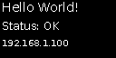

| Parameter | Description        | Required | Default    | Notes                                                        |
|-----------|--------------------|----------|------------|--------------------------------------------------------------|
| `value`   | Text to display    | Yes      | —          | String                                                       |
| `x`       | X position         | Yes      | —          | Pixels or `"N%"`                                             |
| `y`       | Y position         | Yes      | —          | Pixels or `"N%"`                                             |
| `size`    | Font size          | No       | `20`       | Pixels                                                       |
| `anchor`  | Reference point    | No       | `lt`       | `lt` top-left · `mm`/`center` middle · `rb` bottom-right … |

```yaml
- type: text
  value: "CPU 42C"
  x: "50%"
  y: "50%"
  size: 14
  anchor: center   # centred on screen
```

---

### multiline

Splits text on a delimiter and draws each segment as a separate line.

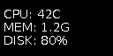

| Parameter   | Description                     | Required | Default | Notes                               |
|-------------|---------------------------------|----------|---------|-------------------------------------|
| `value`     | Text with delimiter-separated lines | Yes  | —       | String                              |
| `x`         | X position                      | Yes      | —       | Pixels or `"N%"`                    |
| `y`         | Y position                      | Yes      | —       | Pixels or `"N%"`                    |
| `delimiter` | Character used to split lines   | No       | `\|`    | Single character                    |
| `offset_y`  | Additional vertical offset      | No       | `0`     | Pixels                              |
| `size`      | Font size                       | No       | `20`    | Pixels                              |
| `spacing`   | Extra spacing between lines     | No       | `2`     | Pixels                              |
| `anchor`    | Reference point                 | No       | `lt`    | Same values as `text`               |

```yaml
- type: multiline
  value: "Line 1|Line 2|Line 3"
  delimiter: "|"
  x: 0
  y: 0
  size: 12
  spacing: 2
```

---

### line

Draws a straight line between two points.

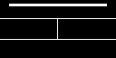

| Parameter | Description              | Required | Default    | Notes                        |
|-----------|--------------------------|----------|------------|------------------------------|
| `x_start` | Starting X position      | Yes      | —          | Pixels or `"N%"`             |
| `y_start` | Starting Y position      | Yes      | —          | Pixels or `"N%"`             |
| `x_end`   | Ending X position        | Yes      | —          | Pixels or `"N%"`             |
| `y_end`   | Ending Y position        | No       | `y_start`  | Pixels or `"N%"`             |
| `width`   | Line thickness           | No       | `1`        | Pixels; minimum `1`          |

```yaml
- type: line
  x_start: 0
  y_start: "50%"
  x_end: "100%"
  y_end: "50%"
  width: 2
```

---

### rectangle

Draws a rectangle outline; optionally fills the interior.
Use `fill: true` instead of the old `filled_rectangle` type.

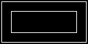 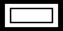

| Parameter | Description                    | Required | Default | Notes                            |
|-----------|--------------------------------|----------|---------|----------------------------------|
| `x_start` | Left edge X position           | Yes      | —       | Pixels or `"N%"`                 |
| `y_start` | Top edge Y position            | Yes      | —       | Pixels or `"N%"`                 |
| `x_end`   | Right edge X position          | Yes      | —       | Pixels or `"N%"`                 |
| `y_end`   | Bottom edge Y position         | Yes      | —       | Pixels or `"N%"`                 |
| `fill`    | Fill the interior with color   | No       | `false` | `true` / `false`                 |
| `width`   | Outline thickness              | No       | `1`     | Pixels; minimum `1`              |

```yaml
- type: rectangle
  x_start: 10
  y_start: 10
  x_end: 100
  y_end: 40
  fill: true
  width: 2
```

---

### polygon

Draws a polygon defined by a list of vertices.

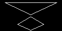 

| Parameter | Description                    | Required | Default | Notes                                                          |
|-----------|--------------------------------|----------|---------|----------------------------------------------------------------|
| `points`  | Vertex coordinates             | Yes      | —       | Flat list `[x1,y1,x2,y2,…]` or list of pairs `[[x1,y1],…]`; each coordinate accepts pixels or `"N%"` |
| `fill`    | Fill the interior              | No       | `false` | `true` / `false`                                               |
| `width`   | Outline thickness              | No       | `1`     | Pixels; minimum `1`                                            |

```yaml
- type: polygon
  points: [10, 5, 117, 5, 63, 50]   # triangle
  fill: false
  width: 1
```

---

### circle

Draws a circle specified by its centre point and radius.

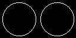 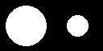

| Parameter | Description              | Required | Default | Notes                                                   |
|-----------|--------------------------|----------|---------|---------------------------------------------------------|
| `x`       | Centre X position        | Yes      | —       | Pixels or `"N%"`                                        |
| `y`       | Centre Y position        | Yes      | —       | Pixels or `"N%"`                                        |
| `radius`  | Circle radius            | Yes      | —       | Pixels or `"N%"` of `min(width, height)`                |
| `fill`    | Fill the circle          | No       | `false` | `true` / `false`                                        |
| `width`   | Outline thickness        | No       | `1`     | Pixels; minimum `1`                                     |

```yaml
- type: circle
  x: "50%"
  y: "50%"
  radius: "40%"
  fill: false
```

---

### ellipse

Draws an ellipse defined by its bounding box.

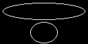 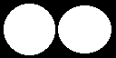

| Parameter | Description                    | Required | Default | Notes            |
|-----------|--------------------------------|----------|---------|------------------|
| `x_start` | Left edge X position           | Yes      | —       | Pixels or `"N%"` |
| `y_start` | Top edge Y position            | Yes      | —       | Pixels or `"N%"` |
| `x_end`   | Right edge X position          | Yes      | —       | Pixels or `"N%"` |
| `y_end`   | Bottom edge Y position         | Yes      | —       | Pixels or `"N%"` |
| `fill`    | Fill the ellipse               | No       | `false` | `true` / `false` |
| `width`   | Outline thickness              | No       | `1`     | Pixels; minimum `1` |

```yaml
- type: ellipse
  x_start: "10%"
  y_start: "10%"
  x_end: "90%"
  y_end: "90%"
  fill: true
```

---

### arc

Draws a curved arc segment (open curve, no fill).

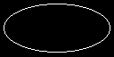 

| Parameter | Description                    | Required | Default | Notes                                             |
|-----------|--------------------------------|----------|---------|---------------------------------------------------|
| `x_start` | Bounding box left X            | Yes      | —       | Pixels or `"N%"`                                  |
| `y_start` | Bounding box top Y             | Yes      | —       | Pixels or `"N%"`                                  |
| `x_end`   | Bounding box right X           | Yes      | —       | Pixels or `"N%"`                                  |
| `y_end`   | Bounding box bottom Y          | Yes      | —       | Pixels or `"N%"`                                  |
| `start`   | Start angle                    | No       | `0`     | Degrees (0=right, 90=down) or `"N%"` of 360°      |
| `end`     | End angle                      | No       | `180`   | Degrees or `"N%"` of 360°                         |
| `width`   | Line thickness                 | No       | `1`     | Pixels; minimum `1`                               |

```yaml
- type: arc
  x_start: 10
  y_start: 10
  x_end: 110
  y_end: 54
  start: 0
  end: 180
  width: 2
```

---

### pieslice

Draws a pie-chart slice defined by a bounding box and two angles.

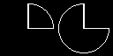 

| Parameter | Description                    | Required | Default | Notes                                             |
|-----------|--------------------------------|----------|---------|---------------------------------------------------|
| `x_start` | Bounding box left X            | Yes      | —       | Pixels or `"N%"`                                  |
| `y_start` | Bounding box top Y             | Yes      | —       | Pixels or `"N%"`                                  |
| `x_end`   | Bounding box right X           | Yes      | —       | Pixels or `"N%"`                                  |
| `y_end`   | Bounding box bottom Y          | Yes      | —       | Pixels or `"N%"`                                  |
| `start`   | Start angle                    | No       | `0`     | Degrees (0=right, 90=down) or `"N%"` of 360°      |
| `end`     | End angle                      | No       | `180`   | Degrees or `"N%"` of 360°                         |
| `fill`    | Fill the slice                 | No       | `false` | `true` / `false`                                  |
| `width`   | Outline thickness              | No       | `1`     | Pixels; minimum `1`                               |

```yaml
- type: pieslice
  x_start: 10
  y_start: 4
  x_end: 118
  y_end: 60
  start: 30
  end: 330
  fill: true
```

---

### dlimg

Loads a local image file and pastes it onto the display canvas.
The image is converted to 1-bit (black & white) before pasting.

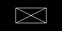

| Parameter | Description                           | Required | Default           | Notes                                 |
|-----------|---------------------------------------|----------|-------------------|---------------------------------------|
| `url`     | Absolute path to the image file       | Yes      | —                 | Local filesystem path, e.g. `/config/www/oled/logo.png` |
| `x`       | Paste X position (top-left corner)    | Yes      | —                 | Pixels or `"N%"`                      |
| `y`       | Paste Y position (top-left corner)    | Yes      | —                 | Pixels or `"N%"`                      |
| `xsize`   | Target width after resize             | No       | Image native width  | Pixels; skipped if `0`              |
| `ysize`   | Target height after resize            | No       | Image native height | Pixels; skipped if `0`              |

```yaml
- type: dlimg
  url: "/config/www/oled/logo.png"
  x: 0
  y: 0
  xsize: 64
  ysize: 32
```

---

### pixel

Draws a single pixel at the specified coordinates.

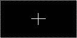

| Parameter | Description      | Required | Default | Notes                 |
|-----------|------------------|----------|---------|-----------------------|
| `x`       | X position       | Yes      | —       | Pixels or `"N%"`      |
| `y`       | Y position       | Yes      | —       | Pixels or `"N%"`      |

```yaml
- type: pixel
  x: "50%"
  y: "50%"
```

---

### progress_bar

Draws a filled progress bar with an optional centred percentage label.
The label is composited with XOR so it is always legible — black text over the
filled region, white text over the empty region — at any progress value.

**Progress levels** (direction: right)

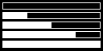

**Fill directions** at 60 %

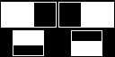

**Percentage text** (`show_percentage: true`, XOR composited)

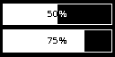

**Visual styles** — standard / thick border / inverted colours

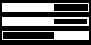

| Parameter        | Description                              | Required | Default  | Notes                                          |
|------------------|------------------------------------------|----------|----------|------------------------------------------------|
| `x_start`        | Left edge X position                     | Yes      | —        | Pixels or `"N%"`                               |
| `y_start`        | Top edge Y position                      | Yes      | —        | Pixels or `"N%"`                               |
| `x_end`          | Right edge X position                    | Yes      | —        | Pixels or `"N%"`                               |
| `y_end`          | Bottom edge Y position                   | Yes      | —        | Pixels or `"N%"`                               |
| `progress`       | Fill level                               | Yes      | —        | `0`–`100`; clamped to range                    |
| `direction`      | Fill direction                           | No       | `right`  | `right` / `left` / `up` / `down`               |
| `background`     | Color of the unfilled region             | No       | `black`  | `black` / `white`                              |
| `fill`           | Color of the filled region               | No       | `white`  | `black` / `white`                              |
| `outline`        | Border color                             | No       | `white`  | `black` / `white`                              |
| `width`          | Border thickness                         | No       | `1`      | Pixels; minimum `1`                            |
| `show_percentage`| Draw a centred `N%` label inside the bar | No       | `false`  | Label uses XOR compositing for contrast        |
| `size`           | Font size for the percentage label       | No       | `8`      | Pixels; only used when `show_percentage: true` |

```yaml
- type: progress_bar
  x_start: 4
  y_start: 50
  x_end: 123
  y_end: 62
  progress: 72
  direction: right
  show_percentage: true
```

---

### icon

Draws a [Material Design Icon](https://pictogrammers.com/library/mdi/) from
the bundled `materialdesignicons.ttf` font (MDI v7.4.47, 7 447 icons).

The icon is guaranteed to fit exactly inside the declared square.
For example `x=10, y=20, size=30` places the icon in the pixel region `(10, 20) → (39, 49)` —
nothing outside that square is touched.

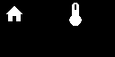

| Parameter | Description                           | Required | Default | Notes                                                      |
|-----------|---------------------------------------|----------|---------|------------------------------------------------------------|
| `value`   | Icon name                             | Yes      | —       | With or without `mdi:` prefix, e.g. `"mdi:home"` or `"home"` |
| `x`       | Top-left corner X position            | Yes      | —       | Pixels or `"N%"`                                           |
| `y`       | Top-left corner Y position            | Yes      | —       | Pixels or `"N%"`                                           |
| `size`    | Side length of the icon square        | Yes      | —       | Pixels; minimum `6`                                        |
| `fill`    | Icon color                            | No       | `white` | `black` / `white`                                          |

```yaml
- type: icon
  value: "mdi:home"
  x: 4
  y: 4
  size: 24
  fill: white
```

---

## Other Services

| Service                             | Description                          |
|-------------------------------------|--------------------------------------|
| `argon_industria_oled.clear`        | Clears the display to black          |
| `argon_industria_oled.show_logo`    | Redraws the startup splash / logo    |

## Hardware Notes

| Property         | Value        |
|------------------|--------------|
| I2C bus          | `1`          |
| I2C address      | `0x3C`       |
| Resolution       | `128x64`     |
| Linux I2C path   | `/dev/i2c-1` |

## Development Checks

Run before commit:

```bash
python -m pip install -r requirements_dev.txt

ruff format --check .
ruff check .
mypy custom_components/argon_industria_oled
pylint custom_components/argon_industria_oled

hassfest
```

## License

MIT (see LICENSE).
